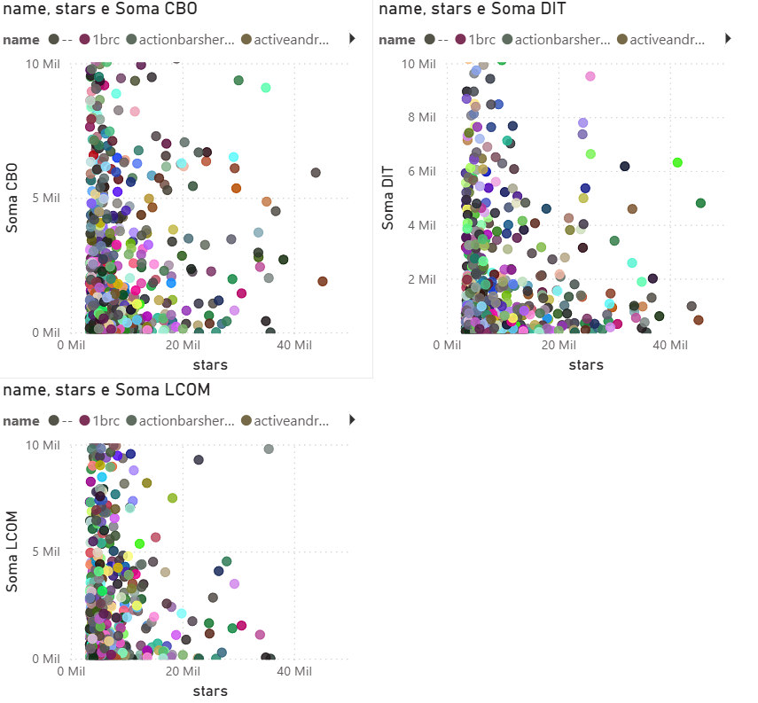
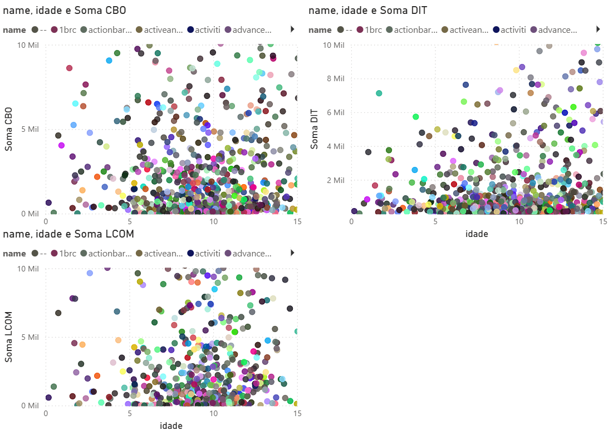
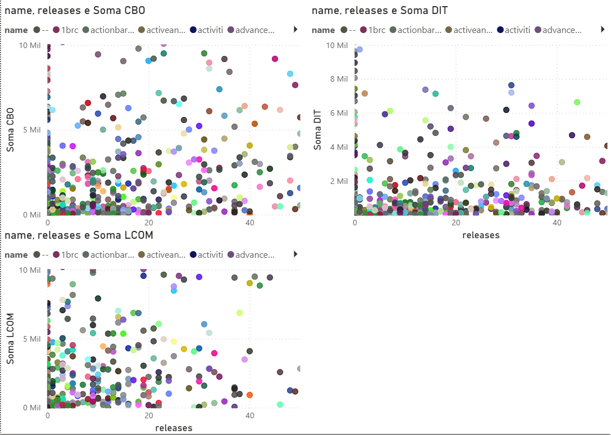
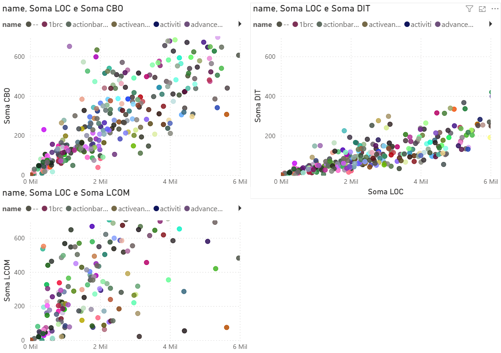

# 🧪 Laboratório 02 – Um Estudo das Características de Qualidade de Sistemas Java

**Alunos:**  
- Luiz Felipe Campos de Morais  
- Marcus Vinícius Carvalho de Oliveira  

---

## 📌 Introdução
No desenvolvimento de sistemas *open-source*, em que diversos desenvolvedores contribuem em diferentes partes do código, há riscos relacionados à **evolução da qualidade interna**.  
Aspectos como **modularidade, manutenibilidade e legibilidade** podem ser comprometidos caso não haja boas práticas de revisão ou análise estática.  

Neste trabalho, analisamos **repositórios Java populares no GitHub** sob a perspectiva de métricas de qualidade calculadas pela ferramenta **CK**, buscando compreender como atributos de processo (popularidade, maturidade, atividade e tamanho) se relacionam com a qualidade do software.  

---

## ❓ Questões de Pesquisa

| RQ | Pergunta |
|----|----------|
| **RQ01** | Qual a relação entre a **popularidade** dos repositórios e as suas características de qualidade? |
| **RQ02** | Qual a relação entre a **maturidade** dos repositórios e as suas características de qualidade? |
| **RQ03** | Qual a relação entre a **atividade** dos repositórios e as suas características de qualidade? |
| **RQ04** | Qual a relação entre o **tamanho** dos repositórios e as suas características de qualidade? |

---

## 💡 Hipóteses Informais

- **RQ01:** Repositórios mais populares (mais estrelas) tendem a apresentar melhores métricas de qualidade, já que atraem mais colaboradores e maior rigor no processo de desenvolvimento.  
- **RQ02:** Repositórios mais maduros (mais antigos) devem apresentar maior estabilidade e possivelmente melhor coesão, mas também podem acumular mais acoplamento devido à evolução do código.  
- **RQ03:** Repositórios com maior atividade (mais *releases*) provavelmente mantêm boas práticas de engenharia, refletidas em melhor modularidade e manutenibilidade.  
- **RQ04:** Repositórios maiores (mais linhas de código) tendem a ter maior acoplamento e menor coesão, impactando negativamente a qualidade interna.  

---

## ⚙️ Metodologia

1. **Coleta dos Repositórios**  
   - Utilizamos a **API GraphQL do GitHub** para coletar os **1.000 repositórios mais populares escritos em Java**.  
   - Foram extraídas as seguintes métricas de processo:  
     - **Popularidade:** número de estrelas ⭐  
     - **Maturidade:** idade do repositório em anos 📅 (diferença entre a data de criação e a data atual)  
     - **Atividade:** número de *releases* 🚀  

2. **Geração do Dataset**  
   - As informações extraídas foram consolidadas em um arquivo **CSV (`repositorios.csv`)** contendo:  
     - Nome do repositório  
     - Número de *releases*  
     - Número de estrelas  
     - Idade em anos  

3. **Extração das Métricas de Qualidade (CK Tool)**  
   - Cada repositório foi **clonado localmente**.  
   - Utilizamos a ferramenta **[CK](https://github.com/mauricioaniche/ck)** para análise estática do código.  
   - Foram extraídas as métricas de qualidade:  
     - **CBO (Coupling Between Objects)** – acoplamento entre classes.  
     - **DIT (Depth of Inheritance Tree)** – profundidade da hierarquia de herança.  
     - **LCOM (Lack of Cohesion of Methods)** – coesão entre os métodos de uma classe.  

4. **Análise Estatística**  
   - Para cada questão de pesquisa (RQ), serão calculados **média, mediana e desvio padrão** das métricas de qualidade.  
   - As análises buscarão identificar correlações entre métricas de processo e métricas de qualidade.  

---

## 📊 Resultados

### 🔹 RQ01: Popularidade × Qualidade

Embora ter boa qualidade (baixo CBO, DIT e LCOM) não garanta a popularidade (há muitos projetos de boa qualidade com poucas estrelas), os dados sugerem que **má qualidade parece impedir que um projeto se torne popular**.  

Ou seja, características como **baixo acoplamento, boa coesão e hierarquia controlada** parecem ser pré-requisitos para que um repositório alcance grande destaque.  

**Top 100 repositórios mais populares (mais estrelas):**

| Métrica de Qualidade | Média   | Mediana | Desvio Padrão |
|-----------------------|---------|---------|---------------|
| **CBO**              | 1.139,8 | 486,0   | 1.834,1       |
| **DIT**              | 496,5   | 289,5   | 711,5         |
| **LCOM**             | 1.258,4 | 227,5   | 3.193,4       |

---

### 🔹 RQ02: Maturidade × Qualidade
Nos **100 repositórios mais maduros (mais antigos)**, observamos um aumento do acoplamento (CBO) em relação aos mais populares, sugerindo que **o acoplamento tende a crescer com o tempo**.  

| Métrica de Qualidade | Média   | Mediana | Desvio Padrão |
|-----------------------|---------|---------|---------------|
| **CBO**              | 1.583,9 | 808,5   | 1.472,0       |
| **DIT**              | 321,8   | 290,0   | 258,9         |
| **LCOM**             | 1.132,1 | 557,5   | 1.638,4       |

---

### 🔹 RQ03: Atividade × Qualidade
Os **100 repositórios mais ativos (com mais releases)** apresentam as menores médias de CBO e DIT entre todos os grupos analisados. Isso indica que **um ciclo de releases frequente pode estar associado a práticas que controlam melhor acoplamento e complexidade**.

| Métrica de Qualidade | Média   | Mediana | Desvio Padrão |
|-----------------------|---------|---------|---------------|
| **CBO**              | 992,3   | 709,0   | 1.096,9       |
| **DIT**              | 309,8   | 277,5   | 266,0         |
| **LCOM**             | 1.155,5 | 390,5   | 2.503,6       |

---

### 🔹 RQ04: Tamanho × Qualidade
Para esta análise, o **tamanho foi inferido pelo número de linhas de código (LOC)**.  
Os **100 maiores repositórios** apresentam os valores médios mais altos em todas as métricas de qualidade, confirmando a hipótese de que **sistemas maiores tendem a ser mais complexos, mais acoplados e menos coesos**.  

| Métrica de Qualidade | Média   | Mediana | Desvio Padrão |
|-----------------------|---------|---------|---------------|
| **CBO**              | 3.327,1 | 2.067,5 | 3.794,5       |
| **DIT**              | 913,3   | 554,5   | 1.168,0       |
| **LCOM**             | 4.885,9 | 1.109,0 | 10.655,0      |

---

## 🗣️ Discussão

A análise realizada permitiu comparar as hipóteses informais com os resultados obtidos para cada questão de pesquisa.  

- **RQ01 – Popularidade × Qualidade**  
  A hipótese inicial sugeria que projetos mais populares apresentariam melhores métricas de qualidade.  
  Os resultados indicaram que, de fato, **nenhum projeto com métricas de qualidade muito ruins atingiu alta popularidade**. No entanto, a relação não é determinística: existem projetos de boa qualidade com poucas estrelas. Assim, podemos concluir que **boa qualidade é um pré-requisito, mas não suficiente para a popularidade**.  

- **RQ02 – Maturidade × Qualidade**  
  Esperávamos que sistemas mais antigos apresentassem maior estabilidade, mas também possíveis problemas de acoplamento.  
  Os resultados confirmaram essa hipótese: **repositórios mais maduros tiveram valores médios mais altos de CBO**, evidenciando que, ao longo do tempo, há tendência de aumento do acoplamento. Já o DIT e o LCOM não apresentaram crescimento tão expressivo, indicando que a evolução afeta mais o acoplamento do que a coesão ou a profundidade de herança.  

- **RQ03 – Atividade × Qualidade**  
  A hipótese era de que repositórios mais ativos (com mais releases) teriam métricas de qualidade melhores.  
  Os resultados mostraram que os repositórios mais ativos tiveram **menores valores médios de CBO e DIT**, sugerindo que **um ciclo de releases frequente está associado a práticas de engenharia que ajudam a manter o código mais modular e menos complexo**. Essa hipótese foi confirmada.  

- **RQ04 – Tamanho × Qualidade**  
  Esperávamos que repositórios maiores (em LOC) apresentassem métricas piores de qualidade.  
  Os resultados confirmaram fortemente essa hipótese: os repositórios maiores apresentaram **os valores mais altos de CBO, DIT e LCOM**, mostrando que **o crescimento do tamanho do sistema está associado ao aumento do acoplamento, da profundidade de herança e à diminuição da coesão**.  

---

### ✅ Conclusão Geral
De modo geral, os resultados mostraram que:  
- **Popularidade** exige boa qualidade, mas não garante sucesso.  
- **Maturidade** aumenta o risco de acoplamento excessivo.  
- **Atividade** (releases frequentes) favorece manutenção da qualidade.  
- **Tamanho** é um forte fator de degradação da qualidade interna.  

Essas observações reforçam a importância de práticas de engenharia contínuas, como **refatoração, modularização e integração contínua**, para manter a qualidade em projetos Java de longo prazo.  